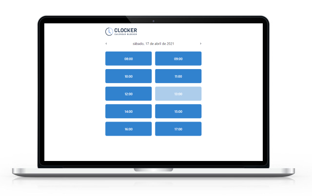

<h1 align="center">
  
</h1>

<h1 align="center">
  
</h1>

<h3 align="center">
  <a href="https://clocker-seven.vercel.app/">Acessar demonstração</a>
</h3>

---

## 📝 Sobre 

O projeto **Clocker** é uma aplicação com NextJs desenvolvido dentro da **Semana Fullstack sem custo** com o intuito de colocarmos em prática  os conteúdo aprendido.

---

## 🚀 Tecnologias utilizadas

Nesta aplicação foram utilizadas:

- [NextJs](https://nextjs.org)
- [Axios](https://github.com/axios/axios)
- [Firebase](https://firebase.google.com/?hl=pt)
- [Chakra-UI](https://chakra-ui.com/)

---

## 📂 Como baixar o projeto

```bash
  # Clonar o repositório
  $ git clone  https://github.com/henriquebazi/clocker

  # Entrar no diretório
  $ cd clocker

  # Iniciar a aplicação
  $ yarn dev
```
---

Desenvolvido por Henrique Bazi.